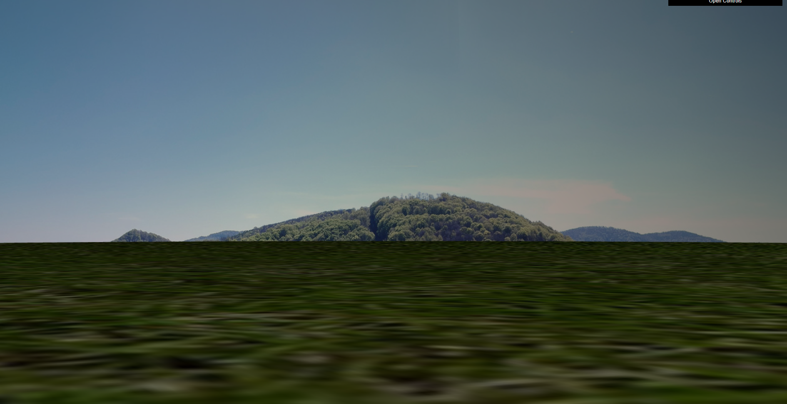
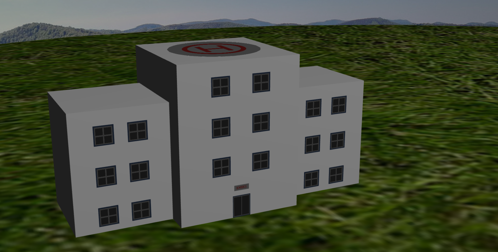
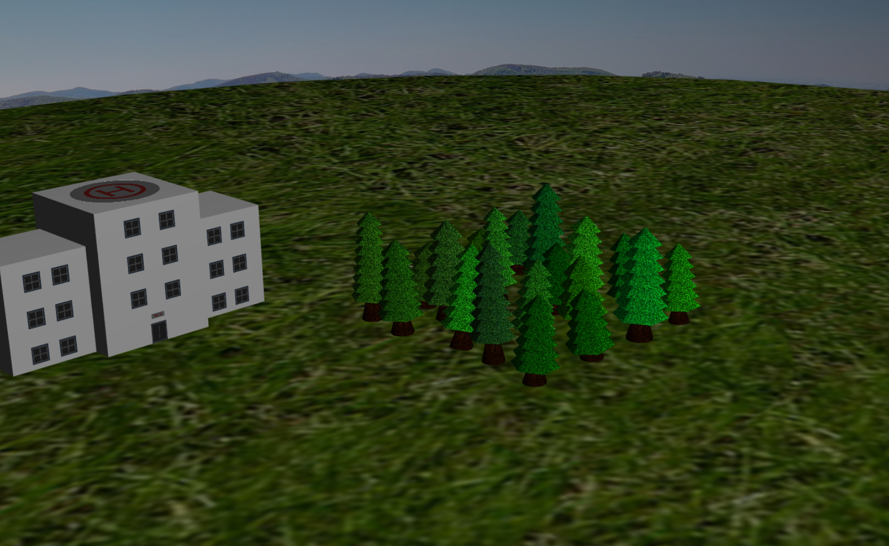
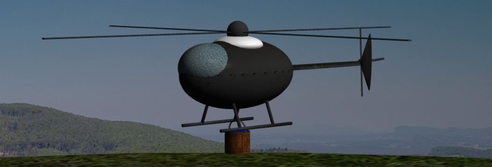
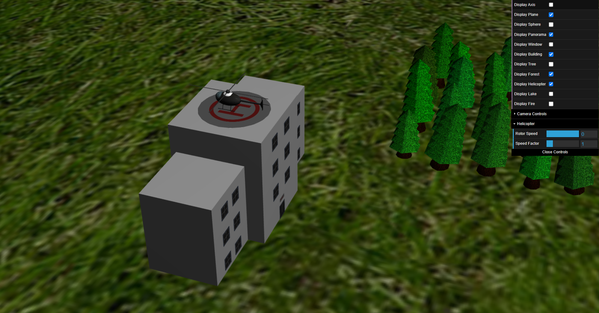
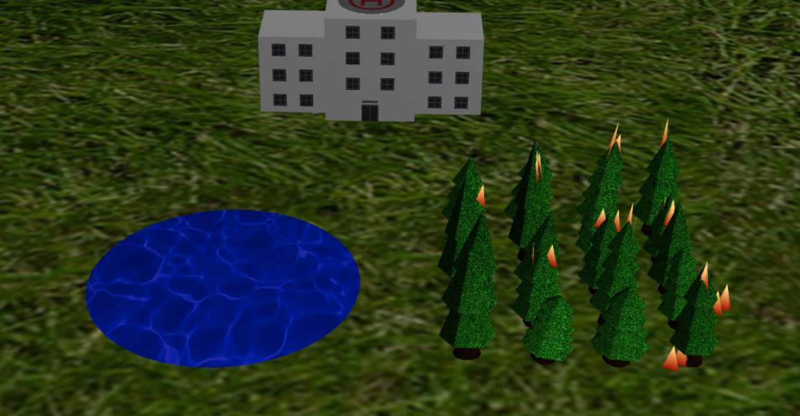
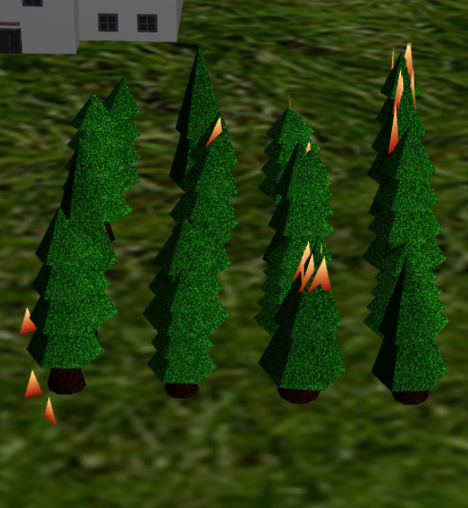
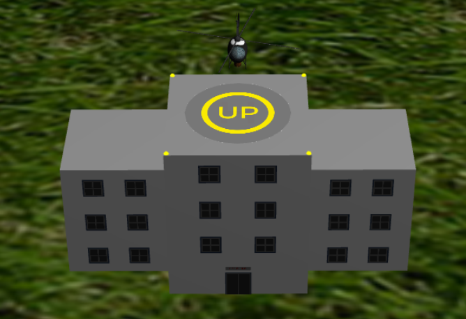

# CG 2024/2025
## Turma 04 - Group 07

| Student Name | Student Number |
| --- | --- |
| Ana Geraldes | 202208030 |
| Filipa Fidalgo | 202208039 |

## Project Notes
We began by creating a simple scene containing a **plane** and a **sphere**, implemented through the `MyPlane` and `MySphere` classes.

To establish an immersive environment, we developed a **panorama** using the `MyPanorama` class. This consists of an inward-facing textured sphere, simulating a surrounding sky or landscape.

Figure 1: Panorama

We implemented a customizable **building** using the `MyBuilding` class, with a **helipad** on its roof. It supports various adjustable parameters, including:
- Width and color
- Number of floors
- Number of windows

Figure 2: Building

We created a **forest region**, using `MyForest` and `MyTree`, populated with multiple tree instances to enhance the natural atmosphere of the scene. Both the **width** and **depth** of the forest can be modified via the UI.

Figure 3: Forest

A fully animated **helicopter**, implemented in the `MyHeli` class, was modeled using several simple geometric shapes, like cylinders etc, and programmed, featuring:
- Controllable flight across the scene
- Rotating blades
- Autonomous landing on the helipad
- A **water bucket** suspended by a cable that extends during flight and retracts when landing

The helicopter interacts dynamically with the environment:
- Collects **water from the lake**
- **Extinguishes forest fires** using the collected water

Figure 4: Helicopter

Figure 5: Helicopter

We added a **lake**, implemented using the `MyLake` class, serving as the primary **water source** for the helicopter.  
A **fire**, implemented through the `MyFire` class, system was implemented within the forest, which can be actively extinguished by the helicopter.

Figure 6: Lake and Fire

To enhance visual realism, we developed **shaders** for:
- **Animated fire effects**
- **Helipad indicators** (UP/DOWN) with smooth **transitions** to guide the helicopter’s landing approach

Figure 7: Fire with Shaders

Figure 8: UP and DOWN references with shaders for transitions
